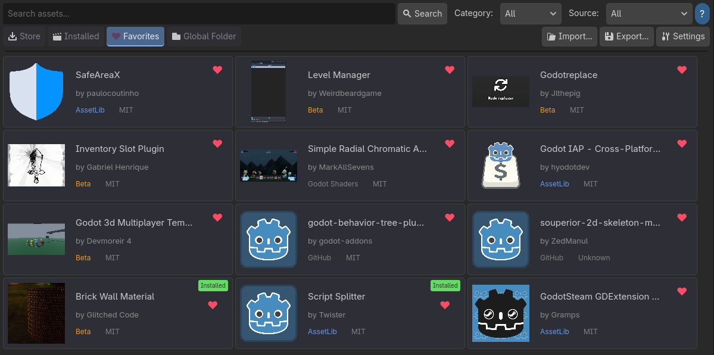

# Favorites

Save your favorite assets for quick access later. Favorites sync across all your Godot projects.

## Adding Favorites

You can favorite assets from multiple places:

- **Store Browser** - Click the heart icon on any asset card or in the detail view
- **Global Library** - Favorite your local `.godotpackage` files
- **Installed Addons** - Favorite installed addons that were matched to online sources

This is useful for keeping track of original asset links, even after installation.

## Viewing Favorites

1. Go to the **Favorites** tab
2. See all your saved assets
3. Click on any favorite to view details or install

## Removing Favorites

- Click the heart icon again to remove from favorites
- Or right-click on a favorite and select **Remove**

## Cross-Project Sync

Favorites are stored globally, not per-project. This means:

- Add a favorite in Project A
- Open Project B
- The same favorites are available

## Storage Location

Favorites are stored in:

| OS | Path |
|----|------|
| Windows | `%APPDATA%/GodotAssetPlus/` |
| Linux | `~/.config/GodotAssetPlus/` |
| macOS | `~/Library/Application Support/GodotAssetPlus/` |

## Offline Access

Favorite metadata is cached locally, so you can see your favorites even without internet. However, installing requires an active connection.
